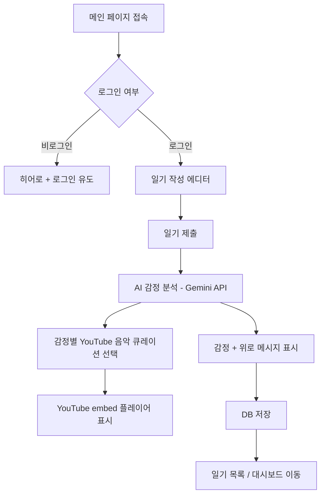

# 🌧️ Bad Day

**"나쁜 하루도 괜찮아."**

일기를 작성하면 AI가 감정을 분석하고, 로열티프리 배경 음악을 추천하며, 위로·응원 메시지를 남겨주는 감정 일기 웹 서비스입니다.

> **Pivot**: VibeBoard (실시간 상태 공유 보드) → Bad Day (AI 감정 일기 웹앱)

## 핵심 기능

| 기능              | 설명                                                     |
| ----------------- | -------------------------------------------------------- |
| 📝 일기 작성      | 하루를 자유롭게 기록                                     |
| 🧠 AI 감정 분석   | Gemini API로 감정 분류 (기쁨, 슬픔, 분노, 불안, 평온 등) |
| 💬 AI 위로 메시지 | 감정에 맞춘 개인화된 위로/응원 메시지 생성               |
| 🎵 배경 음악 추천 | 감정 기반 YouTube 단곡 추천 (API 키 불필요)        |
| 📊 감정 대시보드  | 캘린더 히트맵으로 감정 변화 시각화                       |
| 🎙️ AI 톤 제어    | 1단계 / 2단계 반존댓말 톤 토글 지원                   |

## 기술 스택

### Core

- **Framework**: [Next.js 15](https://nextjs.org) (App Router, Server Actions)
- **Language**: [TypeScript](https://www.typescriptlang.org)
- **Runtime**: Node.js 20+

### UI/Styling

- **Styling**: [Tailwind CSS v4](https://tailwindcss.com)
- **Components**: [Shadcn UI](https://ui.shadcn.com), [Radix UI](https://www.radix-ui.com)
- **Icons**: [Lucide React](https://lucide.dev)
- **Animations**: [Framer Motion](https://www.framer.com/motion)
- **Theming**: [next-themes](https://github.com/pacocoursey/next-themes)

### Backend & Data

- **Authentication**: [Clerk](https://clerk.com)
- **Database**: [Supabase](https://supabase.com) (PostgreSQL + RLS)
- **AI**: [Google Gemini API](https://ai.google.dev) (`gemini-2.5-flash`) — 감정 분석 + 위로 메시지 생성
- **Music**: YouTube Embed — 감정별 큐레이션 YouTube 영상 (API 키 불필요)
- **State Management**: [Zustand](https://github.com/pmndrs/zustand)
- **Data Fetching**: [TanStack Query](https://tanstack.com/query)

### Development

- **Validation**: [Zod](https://zod.dev)
- **Forms**: [React Hook Form](https://react-hook-form.com)
- **Utilities**: [es-toolkit](https://github.com/toss/es-toolkit), [date-fns](https://date-fns.org)
- **Pattern Matching**: [ts-pattern](https://github.com/gvergnaud/ts-pattern)

## 감정 분류 체계

| 감정              | Emoji | 색상      | 음악 장르        |
| ----------------- | ----- | --------- | ---------------- |
| joy (기쁨)        | 😊    | `#FBBF24` | Upbeat, Acoustic |
| sadness (슬픔)    | 😢    | `#60A5FA` | Lo-fi, Piano     |
| anger (분노)      | 😤    | `#F87171` | Rock, Electronic |
| anxiety (불안)    | 😰    | `#A78BFA` | Ambient, Nature  |
| peace (평온)      | 😌    | `#34D399` | Classical, Jazz  |
| excitement (설렘) | 🤩    | `#FB923C` | Pop, Dance       |
| gratitude (감사)  | 🙏    | `#F9A8D4` | Acoustic, Folk   |

## 사용자 플로우



## 시작하기

### 1. 환경 변수 설정

`.env.local` 파일을 생성하고 다음 값을 설정합니다:

```bash
# Clerk Authentication
NEXT_PUBLIC_CLERK_PUBLISHABLE_KEY=your_clerk_publishable_key
CLERK_SECRET_KEY=your_clerk_secret_key

# Supabase
NEXT_PUBLIC_SUPABASE_URL=your_supabase_url
NEXT_PUBLIC_SUPABASE_ANON_KEY=your_supabase_anon_key
SUPABASE_SERVICE_ROLE_KEY=your_supabase_service_role_key

# AI
GEMINI_API_KEY=your_gemini_api_key          # Google AI Studio에서 발급

# Gemini 모델 폴백(추천)
GEMINI_MODEL_PRIMARY=gemini-2.5-flash
GEMINI_MODEL_FALLBACK=gemini-1.5-flash

# AI 톤 기본값(1: 반존댓말, 2: 캐주얼 반말)
GEMINI_VOICE_TONE_LEVEL=2
```

### 2-1. AI 모델 폴백 정책

- `GEMINI_MODEL_PRIMARY` 실패 시 `GEMINI_MODEL_FALLBACK` → `gemini-1.5-pro` 순으로 자동 전환됩니다.
- 키 누락 또는 API 호출 실패 시 안정적인 기본 메시지로 폴백해 대화가 중단되지 않습니다.

### 2-2. 음악 추천 정책

- 검색은 다중 쿼리 기반(감정 키워드 + 감정 강도 키워드)으로 수행
- 단곡 선호: 재생목록/믹스/컴필레이션/오디오북 계열은 제외
- `lyrics`, `cover`, `reaction`, `trailer`, `karaoke`는 감점/제외 처리
- 최종 점수 상위 단일 트랙을 선택(플레이리스트 대체 미동작)

### 2. Supabase 데이터베이스 설정

`supabase/migrations/20260216_create_diary_entries.sql` 마이그레이션을 실행합니다:

```sql
-- diary_entries 테이블 생성
create table if not exists diary_entries (
  id           uuid default gen_random_uuid() primary key,
  user_id      text not null,
  user_name    text not null,
  content      text not null,
  emotion      text,
  emotion_score float,
  ai_message   text,
  music_keyword text,
  music_url    text,
  music_title  text,
  created_at   timestamptz default now()
);
```

### 3. 의존성 설치

```bash
npm install
```

### 4. 개발 서버 실행

```bash
npm run dev
```

브라우저에서 [http://localhost:3000](http://localhost:3000)을 열어 확인합니다.

## 페이지 구조

```
/                        메인 (일기 작성 + AI 응답)
/sign-in                 로그인 (Clerk)
/sign-up                 회원가입 (Clerk)
/(protected)/diary       일기 목록 (타임라인)
/(protected)/diary/[id]  일기 상세 (AI 분석 결과 + 음악)
/(protected)/dashboard   감정 대시보드 (캘린더 히트맵)
```

## 프로젝트 구조

```
src/
├── app/                    # Next.js App Router
│   ├── (protected)/       # 인증 필요 라우트
│   │   ├── dashboard/     # 감정 대시보드
│   │   └── diary/         # 일기 목록 & 상세
│   ├── sign-in/           # 로그인 (Clerk)
│   └── sign-up/           # 회원가입 (Clerk)
├── components/            # React 컴포넌트
│   └── ui/               # Shadcn UI 컴포넌트
├── lib/                   # 유틸리티 및 설정
│   ├── supabase/         # Supabase 클라이언트
│   └── utils.ts          # 공통 유틸리티
├── middleware.ts          # Clerk 미들웨어
supabase/
└── migrations/            # DB 마이그레이션 파일
```

## API 비용

| 항목       | 비용     | 비고                             |
| ---------- | -------- | -------------------------------- |
| Gemini API | **무료** | `gemini-2.5-flash` 기본, 실패 시 자동 폴백 |
| YouTube    | **무료** | embed 방식, API 키 불필요        |
| Supabase   | **무료** | 500MB DB, 50K MAU                |
| Clerk      | **무료** | 10K MAU                          |
| Vercel     | **무료** | Hobby 플랜                       |

> **총 운영비: $0/월** (무료 티어 범위 내)

## 주요 명령어

```bash
# 개발 서버 실행 (Turbopack)
npm run dev

# 프로덕션 빌드
npm run build

# 프로덕션 서버 실행
npm run start

# 린트 검사
npm run lint
```

## 구현 로드맵

1. **Phase 1** — DB 스키마 + 타입 + Gemini 연동
2. **Phase 2** — Server Actions (일기 CRUD + AI 분석)
3. **Phase 3** — UI (메인, 일기 목록, 상세, 대시보드)
4. **Phase 4** — 음악 시스템 + 오디오 플레이어
5. **Phase 5** — 디자인 폴리싱 + 배포

## 배포

Vercel을 통한 배포를 권장합니다:

1. GitHub에 프로젝트를 푸시
2. [Vercel](https://vercel.com)에서 프로젝트 Import
3. 환경 변수 설정
4. 자동 배포 완료

## 라이선스

MIT
