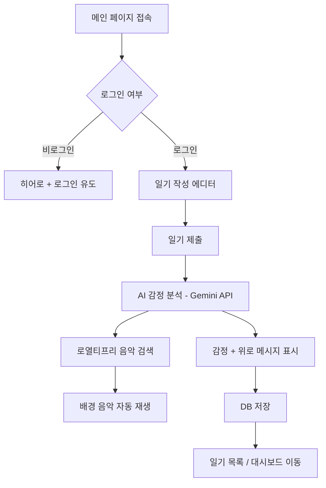

# 🌧️ Bad Day — 프로젝트 피봇 문서

> **VibeBoard** (실시간 상태 공유 보드) → **Bad Day** (AI 감정 일기 웹앱)

## 피봇 배경

기존 VibeBoard는 20자 제한의 실시간 상태 공유 보드였으나,  
보다 감성적이고 개인화된 경험을 제공하기 위해 **AI 감정 일기** 서비스로 전환합니다.

---

## 서비스 컨셉

**"나쁜 하루도 괜찮아."**

사용자가 일기를 작성하면 AI가 감정을 분석하고,  
로열티프리 배경 음악을 추천하며, 위로·응원 메시지를 남겨주는 웹 서비스.

---

## 핵심 기능

| 기능              | 설명                                                     |
| ----------------- | -------------------------------------------------------- |
| 📝 일기 작성      | 하루를 자유롭게 기록                                     |
| 🧠 AI 감정 분석   | Gemini API로 감정 분류 (기쁨, 슬픔, 분노, 불안, 평온 등) |
| 💬 AI 위로 메시지 | 감정에 맞춘 개인화된 위로/응원 메시지 생성               |
| 🎵 배경 음악 추천 | 감정 기반 로열티프리 음악 자동 재생                      |
| 📊 감정 대시보드  | 캘린더 히트맵으로 감정 변화 시각화                       |

---

## 기술 스택

### 유지 (기존 인프라)

| 기술          | 용도       |
| ------------- | ---------- |
| Next.js 15    | 프레임워크 |
| Supabase      | DB + RLS   |
| Clerk         | 인증       |
| TailwindCSS 4 | 스타일링   |
| Framer Motion | 애니메이션 |

### 추가

| 기술                     | 용도                    |
| ------------------------ | ----------------------- |
| Google Gemini API (무료) | 감정 분석 + 메시지 생성 |
| Pixabay Music API        | 로열티프리 음악 검색    |
| `@google/generative-ai`  | Gemini SDK              |

---

## DB 스키마 변경

### 기존: `messages`

```
id, user_id, user_name, content, inserted_at
```

### 신규: `diary_entries`

```sql
create table diary_entries (
  id           uuid default gen_random_uuid() primary key,
  user_id      text not null,
  user_name    text not null,
  content      text not null,          -- 일기 본문
  emotion      text,                   -- AI 분석 감정
  emotion_score float,                 -- 감정 강도 (0.0~1.0)
  ai_message   text,                   -- AI 위로/응원 메시지
  music_keyword text,                  -- 음악 검색 키워드
  music_url    text,                   -- 추천 음악 URL
  music_title  text,                   -- 추천 음악 제목
  created_at   timestamptz default now()
);
```

---

## 감정 분류 체계

| 감정              | Emoji | 색상      | 음악 장르        |
| ----------------- | ----- | --------- | ---------------- |
| joy (기쁨)        | 😊    | `#FBBF24` | Upbeat, Acoustic |
| sadness (슬픔)    | 😢    | `#60A5FA` | Lo-fi, Piano     |
| anger (분노)      | 😤    | `#F87171` | Rock, Electronic |
| anxiety (불안)    | 😰    | `#A78BFA` | Ambient, Nature  |
| peace (평온)      | 😌    | `#34D399` | Classical, Jazz  |
| excitement (설렘) | 🤩    | `#FB923C` | Pop, Dance       |
| gratitude (감사)  | 🙏    | `#F9A8D4` | Acoustic, Folk   |

---

## 사용자 플로우



---

## 페이지 구조

```
/                        메인 (일기 작성 + AI 응답)
/sign-in                 로그인 (Clerk)
/sign-up                 회원가입 (Clerk)
/(protected)/diary       일기 목록 (타임라인)
/(protected)/diary/[id]  일기 상세 (AI 분석 결과 + 음악)
/(protected)/dashboard   감정 대시보드 (캘린더 히트맵)
```

---

## API 비용 분석

| 항목          | 비용     | 비고                  |
| ------------- | -------- | --------------------- |
| Gemini API    | **무료** | 15 RPM, 일 1M 토큰    |
| Pixabay Music | **무료** | API 키 필요, 일 100회 |
| Supabase      | **무료** | 500MB DB, 50K MAU     |
| Clerk         | **무료** | 10K MAU               |
| Vercel        | **무료** | Hobby 플랜            |

> **총 운영비: $0/월** (무료 티어 범위 내)

---

## 환경 변수

```env
# 기존 유지
NEXT_PUBLIC_SUPABASE_URL=
NEXT_PUBLIC_SUPABASE_ANON_KEY=
SUPABASE_SERVICE_ROLE_KEY=
NEXT_PUBLIC_CLERK_PUBLISHABLE_KEY=
CLERK_SECRET_KEY=

# 추가
GEMINI_API_KEY=              # Google AI Studio에서 발급
PIXABAY_API_KEY=             # Pixabay에서 발급 (선택)
```

---

## 구현 우선순위

1. **Phase 1** — DB 스키마 + 타입 + Gemini 연동
2. **Phase 2** — Server Actions (일기 CRUD + AI 분석)
3. **Phase 3** — UI (메인, 일기 목록, 상세, 대시보드)
4. **Phase 4** — 음악 시스템 + 오디오 플레이어
5. **Phase 5** — 디자인 폴리싱 + 배포
